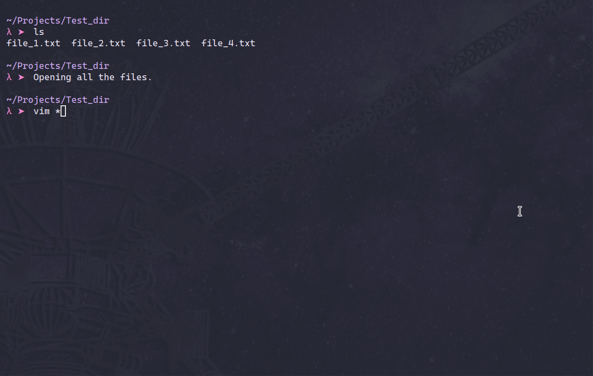

# nvim-select-buffer
Plugin for NeoVim to display and switch to a buffer. (also my first nvim plugin)

# Demo


# Key Features
- Every buffer will get a timestamp when opened
- Timestamps will be updated when you switch to the buffer
- Buffers are sorted by their timestamps
- The switched/current buffer will always be the second on the list. This is because you don't want to switch to the current buffer
- The previous buffer will be the first. This is for quick access/switch between two frequently used buffers

# Installation
Using [packer.nvim](https://github.com/wbthomason/packer.nvim)

```lua
-- In packer.lua add
use 'ArmanHZ/nvim-select-buffer'
```

# Setting keybinding to launch the plugin

Create the `selectbuffer.lua` file in the `/after/plugin` directory and add the following lines:

```lua
-- In /after/plugin/selectbuffer.lua file
local select_buffer = require("select-buffer")
vim.keymap.set("n", "<leader>bb", select_buffer.main)   -- You can use any keybinding you want
```

# Todo
- [ ] (Refactoring) Clean the code and add some color to the display
- [x] ~~Complete the movement feature and select buffer feature~~
- [x] ~~Add help menu below the Buffer text~~
- [x] ~~Prepare the directory structure for 'packer' compatibility~~
- [x] ~~Add a demo video for the repo~~
- [x] ~~Added line highlighting for the buffer window for better visibility~~
- [x] ~~Update old api calls to new ones (exec -> exec2)~~
- [x] ~~Re-write the buffer order, s.t. latest buffers will be at the top~~
- [x] ~~Disable some movement keys while showing the buffer (add unmappings)~~
- [x] ~~Update the demo and readme after all these tasks are done~~

